# Design Document

## Introduction and Overview

This document outlines the design of a Wordle solver program that allows user to determine current day of the word efficiently by using bank of official words. The goal is to create a lightweight static single page application with intuitive minimalistic interface that will solve Wordle.

### Problem Statement

Current implementations don't provide user with immediate response about possible solutions. Also they include a lot of ads/trackers and even application itself weights less than 500kb total page size is around 5mb or more.

### Scope

#### In-Scope
 - Real-time solution output
 - Minimalistic interface
 - Final size optimizations
 - Adaptability for mobile platform (small screen sizes)

#### Out of Scope
 - Multilingual support
 - Application state storage (saving of previously inputted information)

### Tenets: The Guiding Principles

This are non-negotiable points for this system design:
 - Performance. Average solution time must be less than 1ms for average user.
 - Size. The full page with code and styling should be less than 200kb in packaged form.
 - Simplicity. Application should not contain any visual clutter or unnecessary code.
 - Rust-only. All of application code must be written in Rust (except, *unfortunately*, WASM loader itself).

### Risks

Risk: WASM bundle size may exceed 200kb target
 - While it is possible to try to optimise size of WASM bundle during the feature development. It is counterproductive. The bundle size optimization will be the last on the development cycle.

Risk: Word bank accuracy/legality (2315 words source)
 - It is out of scope for this project.

Risk: Browser compatibility for WASM
 - As WASM support is widely available we will not mitigate this. However appropriate message for user without JavaScript/WASM support must be displayed.

Risk: Mobile performance on low-end devices
 - Performance on low-end devices is not taken into account for performance goal, but we should strive for comparable numbers.

Risk: Creating a single HTML file page may be not feasible due to WASM code being inflated while converted string via base64 or base122.
 - Mitigation: split HTML and WASM code to 2 different files and link them together.

### Assumptions
 - Users will primarily access application through desktop and mobile browsers.
 - All computations will be run on the client side.
 - Users use official Wordle game implementation with 2315 words dictionary.

## System Architecture

The application moving parts consist of two big pieces: game solver algorithm and on-DOM visualization logic.
As well as HTML page with styles.

```mermaid
architecture-beta
    group app[Web Page]

    service user(mdi:account)[User]

    service HTML(mdi:code-block-html)[HTML] in app
    service visualizer(mdi:filter-gear)[Visualizer] in app
    service solver(mdi:gear)[Game Solver] in app

    solver:R -- L:visualizer
    visualizer:R -- L:HTML
    HTML:R <-- L:user
```



### Game Solver

Game solver provides only one single API point named `solve` which takes as arguments:
 - `correct_letters` - 5-lettered strings with guessed so far letters, not yet guessed letters are presented as space.
 - `misplaced_letters` - list of 5-lettered strings which contain misplaced letters and their exact guess position. Array length is not capped.
 - `excluded_letters` - a string that contains all of letters that are guessed incorrectly by user.

All of arguments are case-insensitive.

Game solver should not have any internal state as any caching logic is outside of its responsibilities.

### Visualization Logic

This module is responsible for user input handling, managing state of page and rendering game solver results for user.

> *Important note:*
> The visualizer manages DOM state only while solver is stateless.

As one of goals is simplicity, state of application will be fully determined by user input on the page.
This of course will inevitably increase computation requirements of application though it is deemed reasonable.

Caching of previous results are acceptable and left for a developer to decide.

## Data Design

The main decision is representing letters that are contained in a word by using unsigned 32-bit integer as we need only 26 bits to fully represent English alphabet.
It used as a mask should allow for easier comparison to letters that are in the word (correct and misplaced) and excluded letters in only 2 bitwise operations which will (presumably) speed up initial search for candidates.

All words will be stored in single constant byte-array. Padding of said array is optional and should be decided after careful testing in performance difference.
That said array without padding is preferable due to raw size of data 11.3kb without padding vs 18.08kb with padding (each word padded to 8 bytes).

### User Input Validation

Input validation happens at two layers:

- **Visualizer (user-facing)**: Sanitises incorrect data and reflects it in the UI instead of proceeding silently.
  - Tile inputs: a valid letter (A-Z) is accepted, lowercased, and advances to the next tile; a space is treated as a blank and also advances; any other character is rejected — the tile is cleared, a message is shown, and neither navigation advance nor solve runs.
  - Excluded-letters input: invalid characters are dropped and the displayed value is sanitised in place, with a message naming the first dropped character; uppercase letters are lowercased silently.
  - Backspace navigation and the tab/row order are unchanged.
- **Solver (defensive)**: Even though it is expected to receive already-sanitised input, it must recognize any invalid input and return an error value with the reason to the caller, rather than silently proceeding.

The sanitise-and-reflect behaviour described for the visualizer is the preferred end-user experience.

As pasting behaviour is outside the current scope, current functionality when pasting into a tile is to keep the first character only.

Design note: overwriting a filled tile with a rejected character clears the tile but leaves previously computed results on screen; they refresh on the next valid input.

### Word Bank

#### Source
- User-provided word lists in data/ folder
- MVP uses `data/answers/wordle-answers-alphabetical.txt` (2,315 words)

#### Storage Format
- No spaces, continuous 5-byte chunks
- Total size: 11,575 bytes (2,315 × 5)

```rust
// words.rs - generated from data/answers/wordle-answers-alphabetical.txt
pub const WORD_COUNT: usize = 2315;
pub const WORDS: &[u8] = b"abackabaseabate...zinch";
// Access word at index i: &WORDS[i*5..(i+1)*5]
```

#### Pre-computed Masks (Optional Optimization)
- Letter bitmask for each word stored as parallel array
- Allows O(1) letter existence check

## Component Design

There are three major components in the application.

### HTML Page

#### Purpose and Responsibilities
It's responsible for presenting information to the user and receiving inputs from the user.

#### Input and Output Specifications
The direct input for the page consists of user interactions and algorithm results that are propagated through the Visualizer.

Outputs are the user inputted data and events that this data was updated.

#### Algorithms and Processing Logic
There is none.

#### Dependencies on Other Components or External Systems
As page doesn't contain any logic, It's dependent on visualization component to handle user input validation/sanitisation and rendering results on the page.

### Visualizer

#### Purpose and Responsibilities
It's responsible for processing user inputs, triggering solver logic and rendering results onto the page.

#### Input and Output Specifications
The inputs are data from page inputs fields such as current correctly guessed letters, misplaced letters and excluded letters.

Outputs are list of the guesses outputted by the solver that visualizer formats and renders onto the page.

#### Algorithms and Processing Logic

There are no major algorithms involved. Only checks for data correctness: expected format, boundary checks.

Rejected input is made visible to the user: a message is shown via the error element and the offending tile is cleared rather than silently accepted. Advancing to the next tile happens only when a valid letter or a blank (space) is entered, so a rejected character does not advance the tile or trigger a new solve. If error occurred in the solver or too critical to continue processing, show error and stop processing. Processing should restart when inputs are corrected.

#### Dependencies on Other Components or External Systems

This component is dependent on the page to receive inputs and on the solver to process correctly formatted data.

### Game Solver

#### Purpose and Responsibilities
The heart of the application. It contains algorithm to sort through word bank and return possible valid guesses.

#### Input and Output Specifications
As discussed earlier in this document, the inputs are correctly formatted and sanitised strings: guessed letters, misplaced letters and excluded letters.

#### Algorithms and Processing Logic
As baseline algorithm brute-force filtering should be used and guessed must be ranked according most common not yet guessed letters in them.

When system matures we expect to test a few different algorithms for faster filtering and ranking the results.

#### Dependencies on Other Components or External Systems
As far as we know there is no direct dependencies on other components.

## Error Handling

#### Error Types
```rust
pub enum SolverError {
    InvalidCharacter(char),   // Non-ASCII character found
    InvalidLength(usize),     // String not 5 characters
    EmptyInputs,              // ALL of inputs are empty.
}
```

#### User-Facing Errors
- Display a single error message element (`#error`) above the results area.
- On any `solve()` error, show the error message (e.g. "All inputs are empty") and clear the results; hide it on the next successful solve.
- Sanitisation feedback reuses the same element to inform the user that input was rejected or dropped; these messages do not clear the results. If a solver error is already shown by the same input event, it takes precedence and the sanitisation message is not shown.
- Allow immediate correction without page reset.

## Testing Strategy

#### Test Framework
- Standard `#[test]` unit tests, defined inline within each module (`#[cfg(test)]`).
- No external `tests/` directory; no `wasm-bindgen-test` (not yet needed).

#### Test Categories

**Unit Tests - Game Solver**
- Filter matches letters at exact positions
- Filter excludes words with excluded letters
- Filter handles misplaced letters correctly
- Edge cases: no matches returns empty, all letters guessed
- Ranking sorts by letter frequency

**Unit Tests - Input Validation**
- Rejects non-ASCII characters
- Rejects strings != 5 characters
- Handles case insensitivity
- Empty optional fields handled

**Other Unit Tests**
- `SolverError` display/Debug/equality
- Visualizer pure helpers (`tiles_to_pattern`, `sanitize_tile`, `sanitize_excluded`)

#### Test Data
- Inline word-bank constants from `src/words.rs` (subset where fast)
- Known Wordle answers for verification

## Build & Deployment

#### Toolchain
- Rust stable toolchain
- trunk-rs for building and dev server
- wasm-bindgen for WASM bindings (internal)

#### Build Commands
```bash
trunk serve        # Development with hot-reload
trunk build --release  # Production build
```

#### Output Structure
```
dist/
├── index.html
├── style.css
├── wordle_finder-[hash].wasm
└── wordle_finder-[hash].js
```

#### JS Bindings
<!-- TODO: Update if needed -->
- Internal only, not exposed as library
- Could be feature-gated in Cargo.toml if needed later:
```toml
[features]
default = []
js-bindings = []
```

#### Deployment
- Automatic using GitHub Actions
- GitHub Pages from dist/ folder
- No server-side logic required

## File Structure

```
wordle-finder/
├── src/
│   ├── main.rs              # WASM entry point
│   ├── solver/
│   │   ├── mod.rs          # Public API (solve function)
│   │   ├── validator.rs    # Input validation
│   │   ├── error.rs        # Error enum definition
│   │   ├── filter.rs       # Word filtering logic
│   │   └── rank.rs         # Result ranking
│   ├── visualizer.rs       # Visualizer module (DOM logic)
│   └── words.rs            # Word bank constant
├── data/
│   ├── answers/            # Submodule from github gists
│   │   └── (answers).rs    # 2,315 solution words
│   └── guesses.txt         # Valid guess words (for future use)
├── static/
│   └── style.css
├── index.html
├── Cargo.toml
└── DESIGN.md
```

## User Interface

Style of the page must be minimalistic close to original game style. Site must use 5 colours colour palette that may or may not be changed during development.

Most input fields are presented as block of 5 letters for each "word".
1 such word for correctly guessed letters, and 1 or more words for misplaced letters. Excluded letters must be presented as single text input field.

In the desktop version inputs are located on left side of the screen and place for outputs will be located on the right side.

In the mobile version layout is vertical where inputs are above the outputs. In mobile version taking full width minus the padding is expected.

Button for clearing all of inputs are expected.

### Headers

Headers on the page are centred.

### Tile Inputs

Tiles are presented as bordered squares on the background colour. Their size and the letter size inside them scale with the viewport and the user font preferences so the block fits on any platform and narrow screens.

Filled tiles are coloured by the type of the "word" they belong to: correct-letter tiles use the correct colour, misplaced-letter tiles use the misplaced colour. The focused tile is indicated by its border/outline taking the absent colour.

Typing a valid letter or a space (blank) advances focus to the next tile; a rejected character clears the tile and does not advance. See "User Input Validation".

### Misplaced Letters

As there are 1 or more input fields for misplaced letters, there must be a mechanism to add/remove inputs. Maximum number of input "words" is 5 (max guesses in Wordle - 1). It is proposed to have a small button to the right of each "word" that deletes this "word" and a big button at the bottom of the column that adds a new "word" input.

Deletion logic is simple "delete current 'word' input if there more than 1 input left, otherwise clear it".

### Excluded Letters

Excluded letters are entered as a single text input field accepting a string of letters.

### Results

The possible words are shown in the outputs area as equal-width boxes on the tile colour, arranged side-by-side and evenly spaced, wrapping onto further lines as needed. Each word is uppercased and its text is centred within its box.

### Error Field

A single message element appears above the results. It is shown when the current input cannot be solved and when part of the input was rejected or dropped during sanitisation. It uses a palette colour that signals attention is needed rather than an error, is prefixed with ">" and is underlined with a thin line of the same colour.
